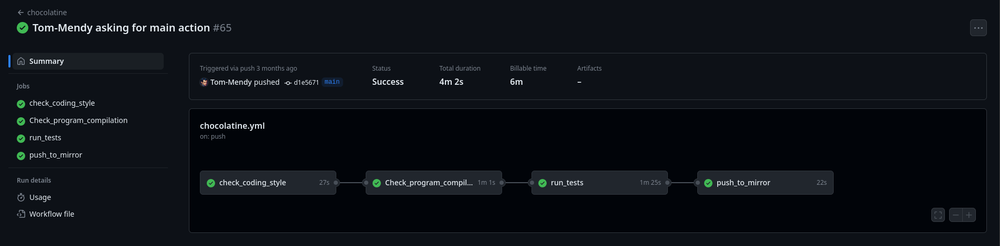

# CHOCOLATINE

## Table of Contents

1. [General Info](#general-info)
2. [Technologies](#technologies)
3. [Overview](#overview)

### General Info

***
The main objective of this project is to setup a GitHub Actions workflow to enforce good practices and diverse rules in a
repository. By utilizing Github Action.

***

## Technologies

A list of technologies used within the project:

* [Github Action](https://github.com/features/actions)

## Overview

***

